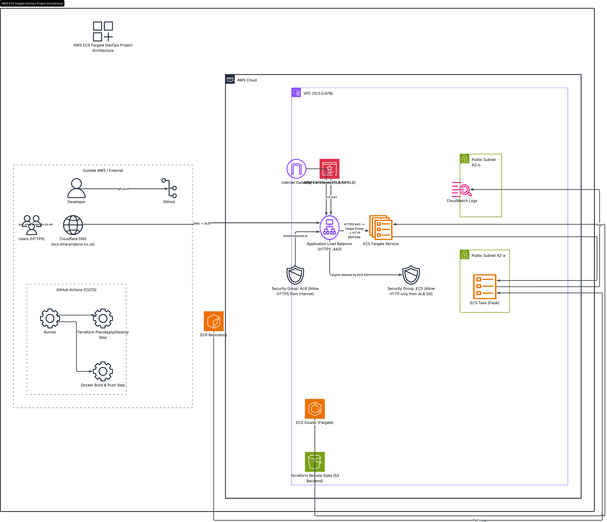

# AWS ECS DevOps Project
Production-style AWS ECS deployment using Terraform, Docker, GitHub Actions, and HTTPS

## Project Overview

This project demonstrates a complete DevOps deployment pipeline using AWS ECS Fargate, Terraform, Docker, GitHub Actions, and Cloudflare DNS automation.

A Python Flask application is containerized with Docker, pushed to Amazon ECR, and deployed automatically to AWS ECS Fargate using Infrastructure as Code (Terraform). GitHub Actions handles CI/CD workflows for building, deploying, and destroying infrastructure.

The application is accessible through a custom domain:

```text
https://ecs.omarprojects.co.uk
```


---

# Technologies Used

## Cloud & Infrastructure

* AWS ECS Fargate
* AWS ECR
* AWS Application Load Balancer
* AWS VPC
* Cloudflare DNS

## DevOps & Automation

* Terraform
* GitHub Actions
* Docker

## Application

* Python
* Flask

---

# Features

* Infrastructure as Code using Terraform
* Containerized Flask application
* Automated Docker image builds
* CI/CD pipelines with GitHub Actions
* ECS Fargate deployment
* Application Load Balancer integration
* Custom domain with Cloudflare
* Automated DNS management with Terraform
* Infrastructure destroy pipeline
* Fully automated deployments

---

# Project Structure

```text
aws-ecs-devops-project/
│
├── .github/workflows/
│   ├── docker-build-push.yml
│   ├── terraform-deploy.yml
│   └── terraform-destroy.yml
│
├── app/
│   ├── app.py
│   ├── requirements.txt
│
├── infra/terraform/
│   ├── modules/
│   │   ├── alb/
│   │   ├── ecs/
│   │   ├── ecr/
│   │   └── vpc/
│   │
│   ├── main.tf
│   ├── variables.tf
│   ├── outputs.tf
    |── backend.tf
│   └── provider.tf
│
├── Dockerfile
└── README.md
```

---


# Architecture Diagram




# CI/CD Pipelines

## 1. Docker Build & Push Pipeline

This workflow:

* Builds the Docker image
* Tags the image
* Pushes the image to Amazon ECR

Workflow file:

```text
.github/workflows/docker-build-push.yml
```

---

## 2. Terraform Deploy Pipeline

This workflow:

* Initializes Terraform
* Creates AWS infrastructure
* Deploys ECS services
* Creates Cloudflare DNS records automatically

Workflow file:

```text
.github/workflows/terraform-deploy.yml
```

---

## 3. Terraform Destroy Pipeline

This workflow:

* Destroys AWS infrastructure
* Deletes Cloudflare DNS records automatically
* Removes ECS resources and networking

Workflow file:

```text
.github/workflows/terraform-destroy.yml
```

---

# Deployment Flow

```text
1. Developer pushes code to GitHub
2. GitHub Actions builds Docker image
3. Docker image is pushed to Amazon ECR
4. Terraform deploys infrastructure
5. ECS Fargate pulls latest image
6. ALB exposes application
7. Cloudflare DNS automatically points domain to ALB
```

---

# Live Application

## Health Endpoint

```text
https://ecs.omarprojects.co.uk/health
```

## Root Endpoint

```text
https://ecs.omarprojects.co.uk
```

---

# Terraform Resources

This project provisions:

* VPC
* Public Subnets
* Internet Gateway
* Route Tables
* Security Groups
* ECS Cluster
* ECS Service
* ECS Task Definition
* ECR Repository
* Application Load Balancer
* Target Groups
* Cloudflare DNS Records

---

# GitHub Secrets Required

The following GitHub repository secrets are required:

```text
AWS_ACCESS_KEY_ID
AWS_SECRET_ACCESS_KEY
CLOUDFLARE_API_TOKEN
```

---

# Future Improvements

Possible future enhancements:

* ECS Auto Scaling
* HTTPS enforcement
* Remote Terraform state (S3 + DynamoDB)
* Blue/Green deployments
* Monitoring with CloudWatch dashboards
* Container vulnerability scanning
* Automated ECS rolling deployments

---

# Lessons Learned

Through this project I learned:

* Infrastructure as Code using Terraform
* AWS ECS Fargate deployments
* Docker containerization
* CI/CD automation with GitHub Actions
* DNS automation using Cloudflare API
* AWS networking fundamentals
* Debugging ECS deployment issues
* Managing production-style infrastructure workflows

---

# Author

Omar Mohamed

GitHub:

```text
https://github.com/Omar-3421
```
